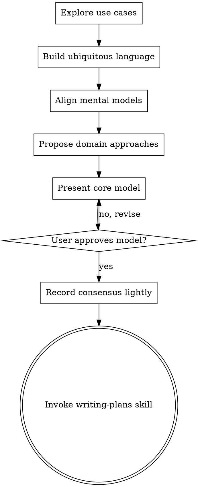

# From Domain Concepts To Working Software

## Overview

Help turn ideas into working software through collaborative domain exploration. The goal is not to produce exhaustive documentation, but to establish a shared understanding of the domain and a model that can be directly expressed in code.

Start by understanding the user's domain and use cases. Extract core business terms and build a ubiquitous language. Defer technical details as long as possible. Once the domain model is clear and aligned with the user's mental model, transition to implementation.

<HARD-GATE>
Do NOT invoke any implementation skill, write any code, or make any technical architecture decisions until you have established a ubiquitous language, explored the domain model with the user, and received their approval. 
</HARD-GATE>

## Anti-Patterns

1. **"This Is Too Simple To Need Domain Exploration"**: Even simple features benefit from clarifying terms. "Simple" projects are where ambiguous terminology causes the most rework. A 2-minute conversation to align on terms is worth it.
2. **"Let's Talk About Tech Stack First"**: Premature technical focus constrains the domain model. Databases, frameworks, and APIs are implementation details; they must serve the domain, not dictate it.
3. **"We Need A Detailed Design Doc"**: Working software over comprehensive documentation. Do not spend hours maintaining diagrams or design docs that go stale immediately. Document only critical consensus.

## Checklist

You MUST create a task for each of these items and complete them in order:

1. **Explore use cases & context** — Understand the user's intent and the business problem.
2. **Extract & build terminology** — Identify nouns and verbs, propose a ubiquitous language glossary.
3. **Align mental models** — Discuss the domain concepts with the user, ensuring their view matches yours. Defer technical details.
4. **Propose 2-3 domain approaches** — Focus on business logic and model trade-offs, not technical architecture.
5. **Present the core model** — Show how the domain model maps to code structures (Entities, Value Objects, etc.). Get user approval.
6. **Record consensus lightly** — Save key terms and model decisions in a lightweight format (e.g., Wiki or brief notes).
7. **Transition to implementation** — Invoke writing-plans skill to create an implementation plan.

## Process Flow

**The terminal state is invoking writing-plans.** Do NOT invoke frontend-design, mcp-builder, or any other implementation skill. The ONLY skill you invoke after domain modeling is writing-plans.

## The Process

**Understanding the Domain:**
- Ask questions about the *business problem* and *use cases*, not the technical solution.
- Listen for key nouns (entities) and verbs (actions/commands).
- Ask one question at a time to refine the concept.
- **Crucial**: If the user starts discussing technical details (databases, APIs, UI components), gently defer the topic: "That's an important implementation detail, let's figure out the core business logic first."

**Establishing Ubiquitous Language:**
- Propose a list of key domain terms based on the conversation.
- Ensure the user agrees with these definitions. This is your shared vocabulary.
- Example: "When you say 'Booking', do you mean the pending request or the confirmed reservation?"

**Aligning Mental Models:**
- Describe the domain model back to the user using the ubiquitous language.
- Focus on the *behavior* and *life cycles* of core concepts (e.g., "An Order starts as Draft, then becomes Confirmed").
- Verify that this model reflects the user's understanding of the real world.

**Exploring Approaches:**
- Propose 2-3 different ways to model the domain logic.
- Discuss trade-offs in terms of *business flexibility* and *conceptual clarity*, not technical performance.
- Lead with your recommended model and explain why it fits the domain best.

**Presenting the Core Model:**
- Present the model in a way that hints at code structure (e.g., "This concept is an Entity with an identity", "This is a Value Object").
- Keep it concise. The model should eventually merge with the code.
- Ask for approval on the *conceptual model*, not the technical architecture.

## After the Design

**Documentation:**
- **Working software over comprehensive documentation.** Do not write a 10-page design document.
- Suggest recording the *Ubiquitous Language Glossary* and *Core Model Decisions* in a lightweight format (e.g., a Wiki page, or a brief `docs/domain-notes.md`).
- Ask the user: "Should I log our key terms and model decisions in the project Wiki or a brief note?"
- Do NOT commit documentation unless explicitly requested. The ultimate documentation is the running code.

**Implementation:**
- Invoke the writing-plans skill to create a detailed implementation plan.
- Do NOT invoke any other skill. writing-plans is the next step.

## Key Principles

- **Ubiquitous Language First** — Align on terms before writing a single line of code.
- **Defer Technical Details** — Databases, frameworks, and APIs are secondary to the domain model.
- **Model as Code** — The domain model should map directly to code structures (Entities, Value Objects). If it doesn't map, the model is wrong.
- **Working Software Over Docs** — Minimize time spent on design documents. Record consensus, then build.
- **One Question at a Time** — Don't overwhelm with multiple questions.
- **YAGNI Ruthlessly** — Remove unnecessary features and abstractions from the domain model.
- **Incremental Validation** — Present the model, get approval before moving on.
