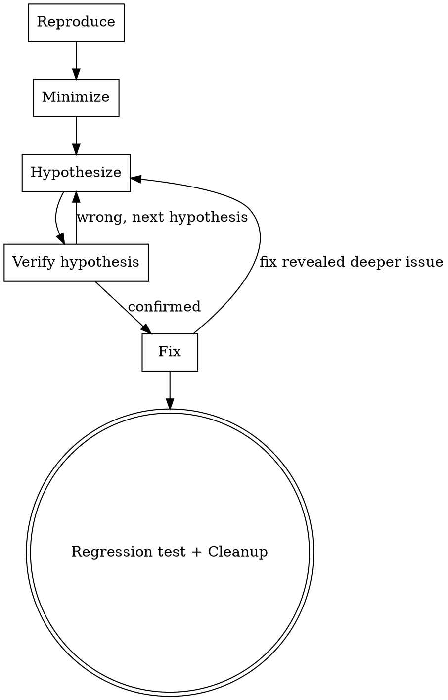

# Systematic Debugging

## Overview

Turn errors into understood root causes, then fix them cleanly. No guessing, no symptom patches.

<HARD-GATE>
Do NOT write any fix code until you have reproduced the issue, minimized its scope, and verified your root cause hypothesis. "Obvious" bugs still need confirmation — if you can't reproduce it, you can't confirm the fix works.
</HARD-GATE>

## Anti-Pattern: "I Know What's Wrong, Let Me Just Fix It"

Every bug goes through this process. A typo, a config error, a null pointer — all of them. Skipping diagnosis is where you fix the wrong thing, introduce new bugs, or waste time on symptoms instead of causes. The reproduction and verification can be brief for simple bugs, but you MUST confirm root cause before fixing.

## Checklist

You MUST create a task for each of these items and complete them in order:

1. **Reproduce** — establish a reliable way to trigger the issue
2. **Minimize** — strip away irrelevant factors to isolate the minimal trigger
3. **Hypothesize** — propose 1-3 root cause hypotheses, rank by likelihood
4. **Verify** — instrument (logs/breakpoints/tests) to confirm the hypothesis
5. **Fix** — make the minimal change that addresses the verified root cause
6. **Regression test + Cleanup** — confirm the fix works, remove diagnostic artifacts, commit

## Process Flow

**The terminal state is passing regression tests with a clean commit.** If the fix reveals a deeper issue, loop back to Hypothesize.

## The Process

**Reproduce:**
- Find or create a reliable way to trigger the issue
- If you can't reproduce it, ask the user for more context (environment, timing, data)
- Prefer automated reproduction (test case, script) over manual steps
- No reproduction = no proceed. Ask for help instead of guessing.

**Minimize:**
- Remove unrelated code, config, data from the reproduction
- Narrow to the smallest input/config that still triggers the issue
- The minimal case is your proof that you understand the boundary conditions

**Hypothesize:**
- Propose 1-3 root cause hypotheses, ranked by likelihood
- One hypothesis at a time — don't try multiple fixes simultaneously
- Write each hypothesis as a specific, testable claim ("X fails because Y when Z")
- Prefer hypotheses that explain all observed symptoms over those that explain only some

**Verify:**
- Add instrumentation to confirm or rule out the top hypothesis
- Logs, breakpoints, temporary assertions, targeted test cases
- If the hypothesis is wrong, move to the next one — don't tweak the failed hypothesis to make it fit
- Once confirmed, you know the root cause. Document it briefly (what, why, where).

**Fix:**
- Make the minimal change that addresses the verified root cause
- Fix the cause, not the symptoms — don't add guards around broken logic
- One focused change, not a bundle of "might help" tweaks

**Regression test + Cleanup:**
- Verify the original reproduction no longer triggers the issue
- Run existing test suite to confirm no side effects
- Remove all diagnostic instrumentation (logs, breakpoints, temp assertions)
- Commit with a message that describes the root cause and fix

## Key Principles

- **Reproduce first** — no fix without a reproducible case
- **One hypothesis at a time** — systematic, not speculative
- **Fix the cause** — patch the root, not the symptoms
- **Minimal fix** — one change that addresses one root cause
- **Leave no trace** — diagnostic code does not belong in the commit
